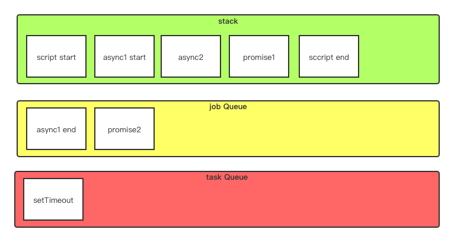

donot talk, show me the code!
## 题目
说出下面的打印日志
```js
async function async1(){
    console.log('async1 start')
    await async2()
    console.log('async1 end')
}

async function async2(){
    console.log('async2')
}

console.log('script start')

setTimeout(function(){
    console.log('setTimeout') 
},0)  

async1();

new Promise(function(resolve){
    console.log('promise1')
    resolve();
}).then(function(){
    console.log('promise2')
})

console.log('script end')
```

## 答案
```js
script start
async1 start
async2
promise1
script end
async1 end
promise2
setTimeout
```

## 原因
___宏任务macrotask__  
setTimeout
setInterval
setImmediate
IO
UI render

__微任务microtask / job__  
Promise
await / async
process.nextTick (node)
Object.observe(不常见)
MutationObserver


宏任务存储在task Queue
微任务存储在job Queue

下面是这道题的图形展示  
_友情提示： stack是程序执行栈，以入栈出栈来操作数据，这里为了方便用队列的形式展示，我们自己心里知道是入栈后出栈即可。_
